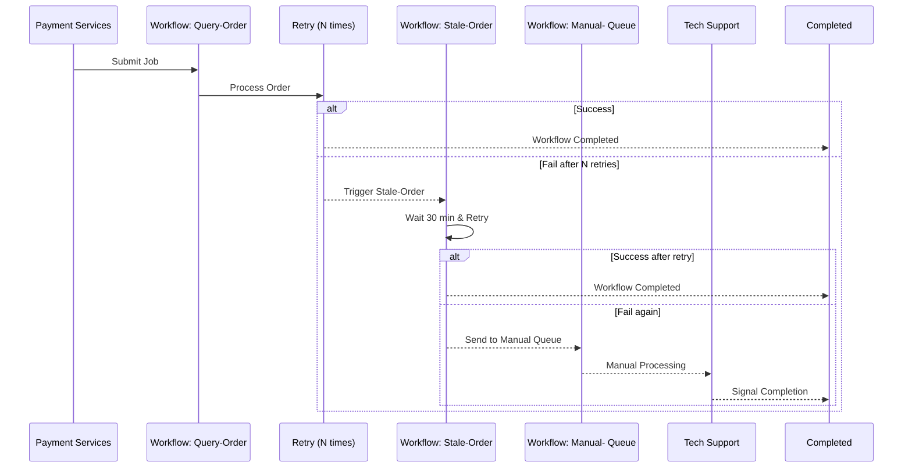

# Temporal Playground 🛝 🎡

This project originated as an engineering solution to overcome a distributed bottleneck in a payment gateway company I currently work at. Previously, silent drop-off payment orders were handled with a simple cron job — an approach that quickly hit scalability limits due to external rate throttling or errors from upstream wallets and banks, and the risk of overwhelming internal databases.

We shifted from periodic batch jobs to continuous, event-driven distributed workflows. Temporal provides the orchestration layer that enables horizontal scalability, fault tolerance, and simplified state management — reducing complexity across payment microservices while ensuring the system can gracefully adapt to real-world constraints.

## Architecture Diagram



## Usage

### Build the application
```bash
make all
```

### Register a namespace
To register a namespace. The official temporal cli has a fantastic support for this API but I wanted to try out the SDK, so here goes.
```bash
./temporal-playground namespace register --name=local-rex 
```

### Start the Worker
To start the Temporal worker (assuming temporal server is installed locally and use default namespace)
```bash
./temporal-playground worker
```

To start the Temporal worker in customer host port and namespace
```bash
./temporal-playground worker -n local-rex --hostport 192.168.100.123:7233
```

### Client Commands

#### Simulate Payment (1 time)
Simulate a single payment event
```bash
./temporal-playground client start -n local-rex
```

Simulate a single payment event, with a custom order ID
```bash
./temporal-playground client start -o test-123 -n local-rex
```

#### Simulate Payments
To simulate real-time payments flooding in for workers to handle:
```bash
./temporal-playground client simulate-payment -n local-rex
```

#### Recurring Payments with scheduled jobs
It takes a lot of load and architectural load moving from managing recurring workloads such as monthly gym membership payment from traditional scheduler approaches to asynchronous approaches such as a workflow engine. Remember to think about payment term lifecycles and ways to terminate. 

I have also included examples of how to manage a workflow version in here. Take a look at `RegisterRecurringPayment` workflow.

To create a recurring payment contract
```bash
./temporal-playground client create-recurring-payment
```

To cancel a recurring payment contract
```bash
./temporal-playground client cancel-recurring-payment -o order-id
```

## Screenshot

With retries and state management in place, every order is deterministically processed at scale.


## Requirements

- Go 1.24+
- Temporal server running locally (default: localhost:7233)

## Disclaimer

This is an exploratory pet project that simulates a past issue we encountered. It contains no proprietary code.